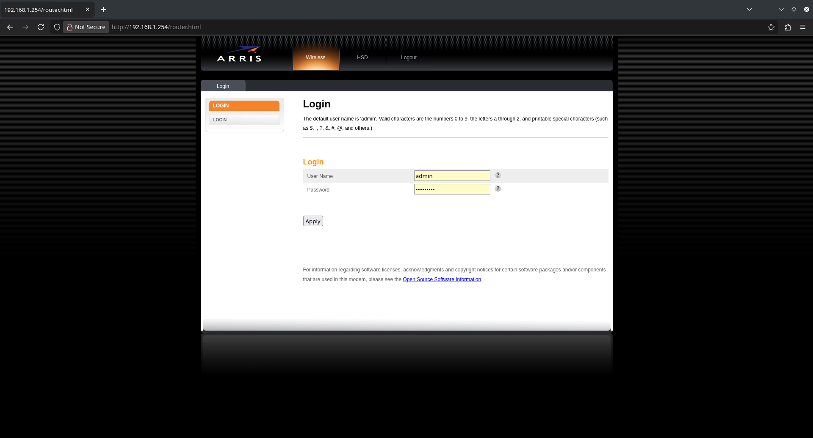
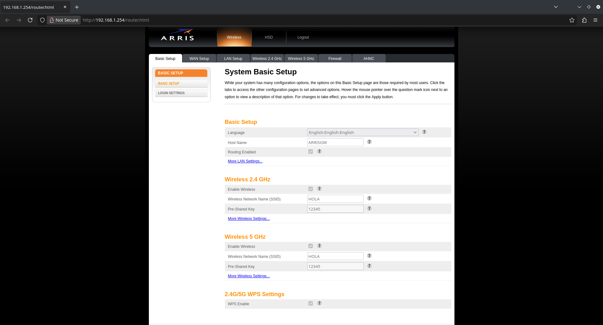
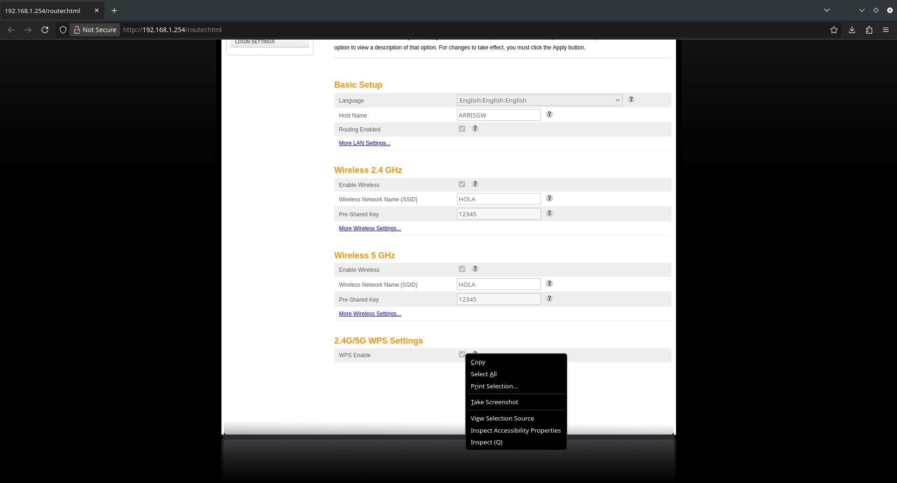
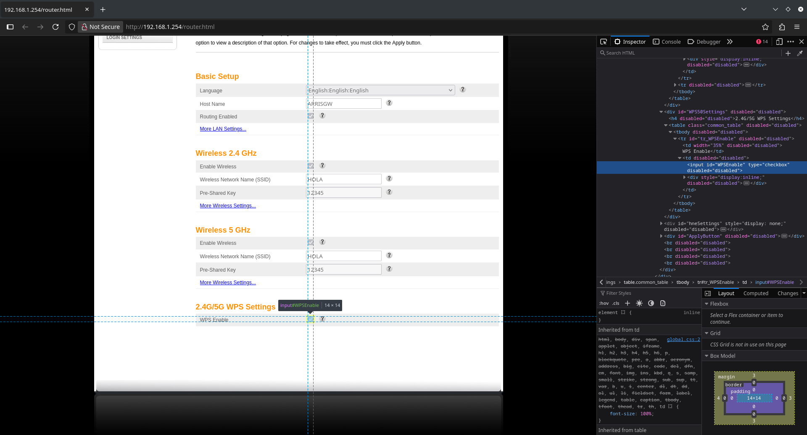
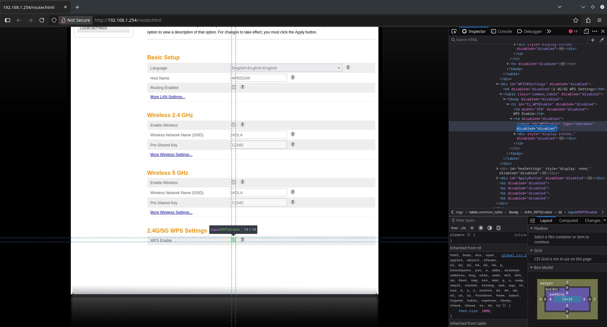
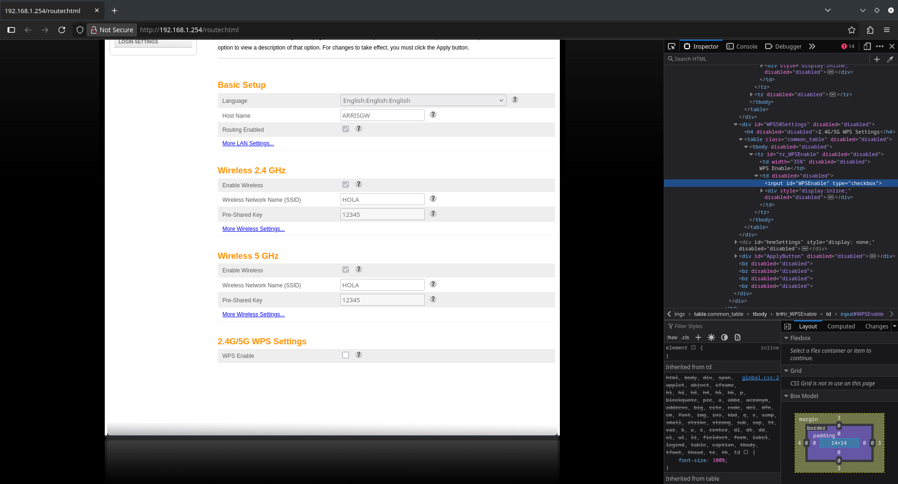
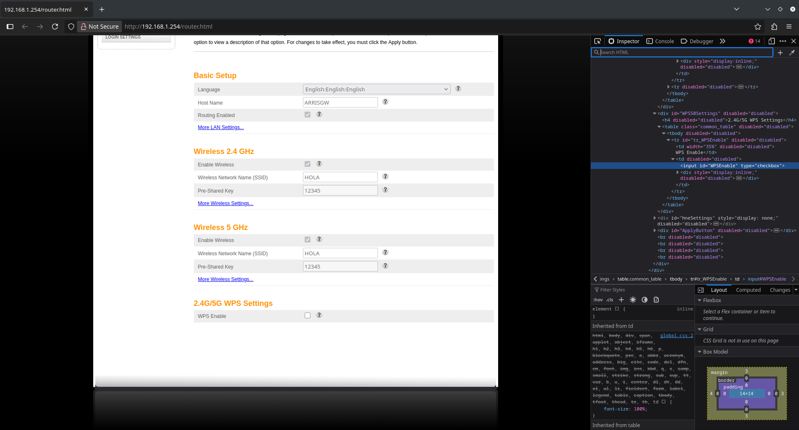
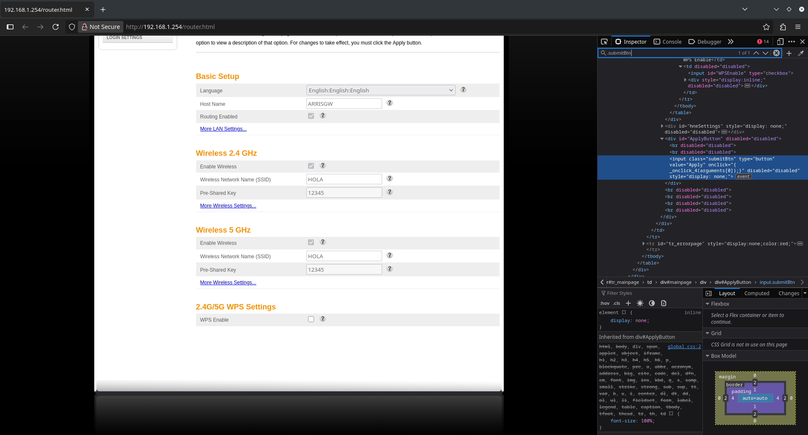
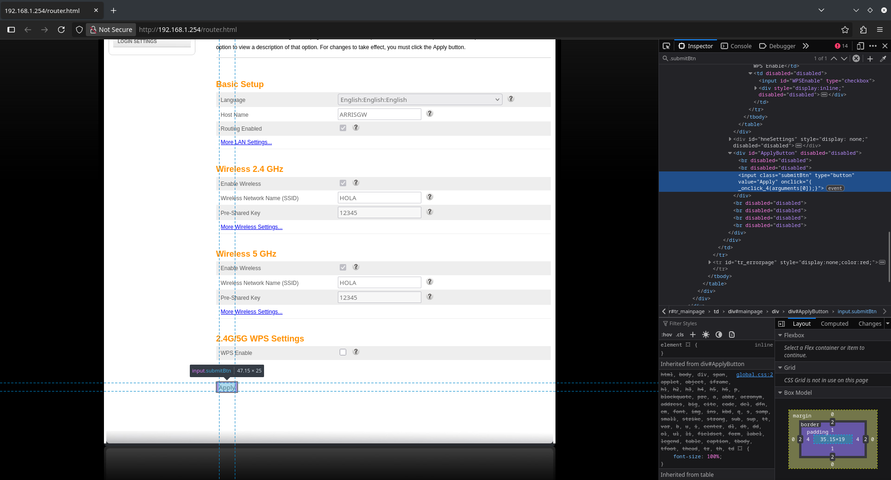

## Cómo modificar la configuración del módem Arris TG2482A

*Descargo de Responsabilidad: Este manual tiene fines educativos y de seguridad personal. El autor no se hace responsable por desconfiguraciones accidentales del equipo.*

En este caso es un módem de la empresa TIGO en Colombia. Al acceder a la configuración se evidencia que hay varias opciones deshabilitadas, es decir, no se pueden modificar. Entre ellas está la del WPS, protocolo que puede ser vulnerable a ataques de fuerza bruta.

Para poder hacer las modificaciones necesitamos un navegador y estar conectados a la misma red del módem.

En este caso, la dirección a la que ingresé fue 192.168.1.254.

El usuario con el que ingresé es admin y la contraseña es @tigoune*.

La puerta de enlace y/o las credenciales pueden ser diferentes, a veces se encuentran en un sticker en la parte inferior o posterior del módem. También se pueden encontrar en internet.

Al entrar, veremos que la opción de WPS Settings está activada y el campo está deshabilitado. Es decir que si hacemos click, la opción no se va a desmarcar.

Para habilitar el campo, haz click derecho en él y selecciona la opción de Inspect o Inspeccionar.

En la parte derecha se abre el inspector de elementos. Nótese que aparece en color azul la casilla que queremos desmarcar.

Debemos hacer doble click en el atributo disabled="disabled", eliminarlo y oprimir Enter.

Ya está habilitada la casilla de WPS Enable, la podemos desmarcar sin problema. Solo falta mostrar el botón de Apply para guardar los cambios.

En el inspector, vamos a oprimir Ctrl + F. En la parte de arriba se mostrará la barra de búsqueda.

Vamos a poner .submitBtn y oprimimos Enter. Aparecerá el código del botón resaltado en azul.

Los atributos disabled="disabled" y style="display: none;" debemos borrarlos. De esta forma se habilitará y mostrará el botón.

Finalmente hacemos click en Apply para que se guarden los cambios.

Este procedimiento se puede aplicar a otras configuraciones que estén deshabilitadas.

Se recomienda apagar y volver a encender el módem para asegurarse de que los cambios quedaron guardados.
